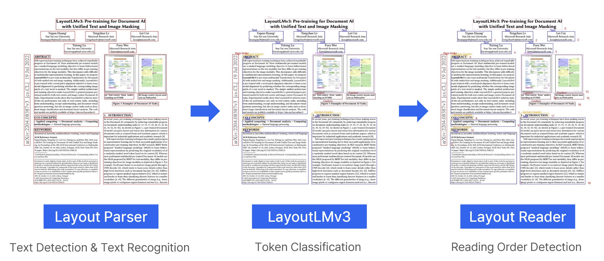

# You Only Search Once

<h3>24-1 YBIGTA x LETSUR 산학 협력 프로젝트</h3>

논문의 다양한 메타정보를 추출하고 이를 기반으로 논문 작성을 보조하는 서비스

 

## 목차
- [문제 정의](#문제-정의)
- [핵심 기능](#핵심-기능)
- [접근 방법](#접근-방법)
- [아키텍처](#아키텍처)
- [결과](#결과)
- [팀 구성](#팀-구성)

## 문제 정의

#### 논문의 메타정보 자동 추출

DBPia와 같은 논문 검색 포탈에서는 제목, 저자, 학회지, 출간 연도와 같은 논문의 메타정보들을 수동으로 추출하고 있다. 따라서 본 프로젝트의 첫 번째 목표는 논문의 PDF 파일을 통해 다양한 메타정보를 추출해주는 인공지능 모델을 개발하는 것이다. 이를 통해 논문 검색 포탈의 관리자가 메타정보를 수동으로 입력하는 번거로움을 덜 수 있다.

#### 선행 연구 정리

연구자들은 논문을 작성할 때 본인의 연구와 관련있는 선행 연구들을 정리하여 서론을 작성하는 단계에서 어려움을 느끼고 있다. 이에 프로젝트의 두 번째 목표를 연구자의 연구 주제 또는 의도에 부합하는 유사한 논문들을 찾아주는 서비스를 구현하는 것으로 설정하였다. 이를 통해 연구자들은 관련된 논문을 더 쉽게 찾고, 논문 작성에 도움을 받을 수 있다.

## 핵심 기능

### 1. 연구자

#### 1.1 핵심 페이퍼 도출

사용자가 (1)본인의 연구 분야, (2)연구를 통해 해결하고자 하는 문제, (3)문제를 해결하기 위한 방안을 짧은 문장으로 제시하면 이를 기반으로 벡터 임베딩을 생성한다. 생성된 임베딩을 통해 벡터 DB로부터 가장 유사한 5개의 논문을 탐색하여 사용자에게 반환한다. 

#### 1.2 연관 페이퍼 탐색

사용자의 쿼리를 기반으로 도출된 핵심 페이퍼를 기준으로 이를 인용 혹은 피인용하는 모든 논문들을 찾아 그래프 형태로 시각화한다. 이 때 그래프의 노드들 중에서 사용자의 쿼리와 관련성이 낮은 노드는 제외되고 관련성이 높은 노드들만 화면에 표시된다.

#### 1.3 그림, 도표 기반 논문 요약

사용자가 특정 논문을 선택하면 해당 논문을 한 눈에 파악할 수 있도록 논문의 메타정보와 함께 그림과 표를 기반으로 생성된 짧은 요약을 보여준다.

### 2. 논문 검색 포탈 관리자

#### 2.1 논문 메타정보 자동 추출

포탈 관리자가 논문의 PDF 파일을 업로드하면 논문의 메타정보 및 논문에 포함된 그림과 표를 자동으로 추출한다. 또한 추출된 그림과 표에 대한 짧은 요약문을 생성하여 추출된 정보들과 함께 데이터베이스에 저장한다.

## 접근 방법

### 1. 메타 정보 추출

#### 1.1 Document Layout Analysis

크게 4단계로 구성된 DLA 태스크를 통해 1차적으로 PDF 파일로부터 논문의 메타정보를 추출한다.

1. *Text Detection*
    - 이미지 내부 텍스트 영역을 나타내는 바운딩 박스 검출
2. *Text Recognition*
    - 주어진 바운딩 박스 내부의 텍스트 인식
3. *Token Classification*
    - 원본 이미지, 바운딩 박스 좌표, 텍스트 내용을 바탕으로 바운딩 박스의 카테고리 분류
4. *Reading Order Detection*
    - 바운딩 박스 좌표, 텍스트 내용을 바탕으로 바운딩 박스들의 맥락적인 순서 정렬

#### 1.2 Summarizer

논문에 포함된 그림 혹은 표와 관련있는 본문 텍스트를 기반으로 짧은 요약문을 생성한다. 본문에서 가장 적절한 문단을 찾기 위해 아래와 같이 총 3가지 방법을 사용하여 후보군을 추출한 뒤 LLM을 통해 요약문을 생성한다.

- Rule-Based Search
    - 특정 단어를 포함하는 문단을 규칙 기반 알고리즘으로 탐색
- Image Search
    - 그림의 이미지 파일과 문단의 텍스트에 대해 각각 임베딩을 생성하여 코사인 유사도가 가장 높은 문단 탐색
    - CLIP-ViT Image Encoder
- Text Search
    - 그림에 매칭되는 캡션과 문단의 텍스트에 대해 각각 임베딩을 생성하여 코사인 유사도가 가장 높은 문단 탐색
    - CLIP-ViT Text Encoder

### 2. 데이터베이스

서비스에 필요한 기능들을 구현하기 위해 **Pinecone, MongoDB, Neo4j**를 적절히 엮어 사용하였고 보조적으로 **PostgreSQL**도 도입하였다.

## 아키텍처

## 결과

## 팀 구성

|이름|팀|역할|
|-|-|-|
|**[정경윤](https://github.com/jkyoon2)**|DS|(역할)|
|**[고준영](https://github.com/Seunim)**|DE|(역할)|
|**[김무현](https://github.com/MooJuice8)**|DS|(역할)|
|**[박정양](https://github.com/wjddid000624)**|DS|(역할)|
|**[유지민](https://github.com/yxxjimin)**|DE|(역할)|
|**[임세은](https://github.com/im-seni)**|DA|(역할)|
|**[정회수](https://github.com/Hoesu)**|DS|(역할)|
